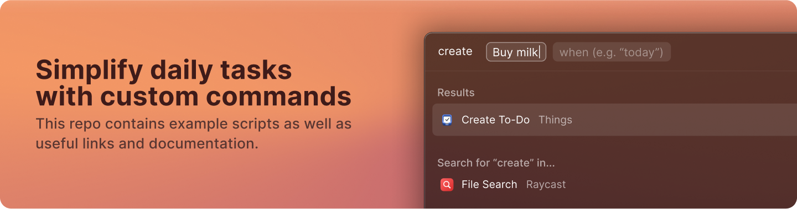

  
  <h1 align="center">Raycast Script Commands</h1>

⌘ Raycast自定义脚本命令

## 资源链接

- [Raycast Script Commands Docs](https://github.com/raycast/script-commands)
- [Raycast Extensions Docs](https://github.com/raycast/script-commands)
- [Icon Maker](https://www.ray.so/icon)
